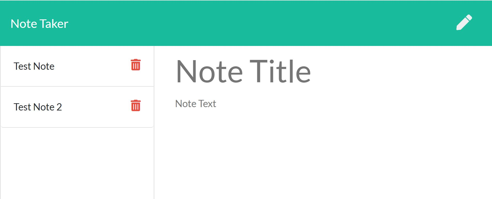

## Note Taker Application
---
 

### Table of Contents
1. [Image](#image)
2. [Description](#desc)
3. [Installation](#install)
4. [Usage link](#use)
5. [Contributing](#contrib)
6. [Tests](#test)
7. [Questions](#quest)
8. [License](#license)
### <a name="image">Image</a>

### <a name="desc">Description</a>
This is a basic note-taker app. Users can:
* Write and store notes (reminders).
* View previously saved notes.
* Delete notes.

### <a name="install">Installation</a>
Clone repository if desired. Remember to install node dependencies before running, using 'npm i' or similar.

### <a name="use">Usage</a>
Application demonstrates basic communication  with a locally setup server (nb - default port if not specified by user is 3000).

### <a name="contrib">Contributing</a>
Project will be discontinued shortly after publication, but general suggestions and feedback are welcome.

### <a name="test">Tests</a>
There are currently to tests for this application.

### <a name="quest">Questions</a>
  * **Github username**: Robert-Court
  * **Email**: [rcourt@live.com.au](rcourt@live.com.au)
  * **Github profile link**: [https://github.com/Robert-Court](https://github.com/Robert-Court)

### <a name="license">License</a>
Please click on the link for more details: [MIT](https://choosealicense.com/licenses/mit/)